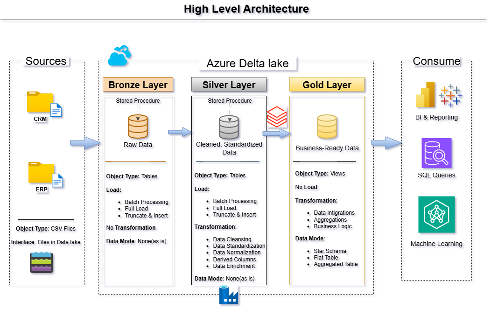
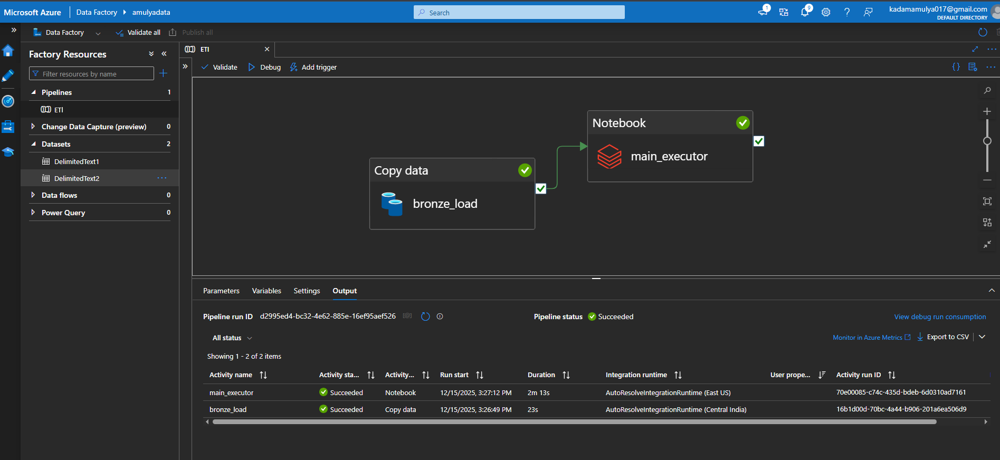

# 🚀 Azure Delta Lake Project (Databricks + ADF)

This project demonstrates an **end-to-end modern data engineering architecture** on **Microsoft Azure** using **Azure Data Factory (ADF)**, **Azure Databricks (Apache Spark)**, and **Delta Lake**. The solution follows the **Medallion Architecture (Bronze, Silver, Gold)** to ingest, transform, and serve data for analytics and reporting.

---

## 📘 Table of Contents

- [Detailed Overview](#-detailed-overview)
- [🚀 Project Requirements](#-project-requirements)
- [Architecture](#-architecture)
- [Data Flow (Data Lineage)](#-data-flow-data-lineage)
- [ADF Pipeline Execution & Monitoring](#-adf-pipeline-execution--monitoring)
- [Technologies Used](#-technologies-used)
- [Folder Structure](#-folder-structure)
- [How to Use](#-how-to-use)
- [Future Enhancements](#-future-enhancements)
- [Contact](#-contact)

---

## 🧩 Detailed Overview

The **Azure Delta Lake Project** showcases how to design and implement a **scalable, cloud-native data platform** using Azure services.

The primary objective is to **ingest, process, and transform data** from multiple source systems (ERP and CRM) into a **Delta Lake-based analytical data store** that supports BI, ad-hoc analytics, and machine learning workloads.

This project highlights:

- **Azure Data Factory (ADF)** for data ingestion and orchestration
- **Azure Databricks (Apache Spark)** for distributed data processing
- **Delta Lake** for reliable, ACID-compliant data storage
- **Medallion Architecture** (Bronze → Silver → Gold) for structured data refinement

The repository serves as a practical reference for **data engineers and cloud practitioners** looking to build production-grade data pipelines on Azure.

---

## 🚀 Project Requirements

### 🧠 Objective

Build a **modern Azure-based data platform** to consolidate sales data and enable analytical reporting using **Databricks and Delta Lake**.

### 📋 Specifications

- **Data Sources:** ERP and CRM datasets (CSV files)
- **Ingestion:** Orchestrated using **Azure Data Factory pipelines**
- **Processing:** Data transformation using **PySpark / Spark SQL** in Azure Databricks
- **Storage:** Delta Lake tables stored in **Azure Data Lake Storage Gen2**
- **Architecture:** Bronze, Silver, and Gold layers
- **Scope:** Latest snapshot data (no historization)
- **Documentation:** Clear architecture, data flow, and transformation logic

---

## 🏗️ Architecture



**High-Level Architecture Flow:**

1. Source data (ERP & CRM CSV files)
2. Azure Data Factory for ingestion and orchestration
3. Azure Data Lake Storage Gen2 as the storage layer
4. Azure Databricks for Spark-based transformations
5. Delta Lake tables organized into Bronze, Silver, and Gold layers
6. Consumption by Power BI / Analytics tools

---

## 🔄 Data Flow (Data Lineage)


---

## 📊 ADF Pipeline Execution & Monitoring



ADF pipelines are used to:

- Trigger data ingestion from source systems
- Execute Databricks notebooks
- Monitor pipeline execution and failures

---

## ⚙️ Technologies Used

| Category | Tools / Technologies |
|--------|---------------------|
| **Cloud Platform** | Microsoft Azure |
| **Orchestration** | Azure Data Factory (ADF) |
| **Processing Engine** | Azure Databricks (Apache Spark) |
| **Storage** | Azure Data Lake Storage Gen2 |
| **Data Format** | Delta Lake |
| **Transformation** | PySpark / Spark SQL |
| **Visualization** | Power BI |
| **Design & Diagrams** | draw.io |
| **Source Systems** | ERP & CRM CSV files |

---

## 📁 Folder Structure

```
Azure_Delta_Lake_Project/
│
├── data/                         # Source data (ERP, CRM)
│   ├── crm/
│   └── erp/
│
├── adf/                          # Azure Data Factory pipeline JSONs
│   ├── ingestion_pipeline.json
│   └── databricks_trigger.json
│
├── databricks/                   # Databricks notebooks
│   ├── bronze_layer/
│   ├── silver_layer/
│   └── gold_layer/
│
├── images/                       # Architecture & pipeline screenshots
│   ├── Azure_data_architecture.png
│   ├── dataflow.png
│   └── ADF_pipeline_log.png
│
├── docs/                         # Documentation
│   ├── data_catalog.md
│   ├── naming_conventions.md
│   └── sales_data_model.md
│
├── README.md
├── LICENSE
└── CONTRIBUTING.md
```

---

## 🚀 How to Use

1. **Clone the repository**

```bash
git clone https://github.com/AmulyaKadam/Azure_Delta_Lake.git
cd Azure_Delta_Lake
```

2. **Set up Azure Resources**

- Azure Data Lake Storage Gen2
- Azure Databricks Workspace
- Azure Data Factory

3. **Upload Source Data**

- Place ERP and CRM CSV files in ADLS Gen2 (raw container)

4. **Run ADF Pipelines**

- Trigger ingestion pipelines
- Monitor execution using ADF pipeline logs

5. **Execute Databricks Notebooks**

- Bronze → Silver → Gold transformations
- Validate Delta tables

6. **Consume Data**

- Connect Power BI to Gold Delta tables
- Run analytical queries or ML workloads

---

## 🔮 Future Enhancements

- Implement **incremental data loads** using watermarking
- Add **Delta Live Tables (DLT)**
- Enable **Unity Catalog** for governance
- Implement **data quality checks** using Spark expectations
- Add **CI/CD for ADF & Databricks** using Azure DevOps

---

## 👤 Contact

**Author:** Amulya Kadam  
📧 **Email:** [kadamamulya017@gmail.com](mailto:kadamamulya017@gmail.com)  
💼 **GitHub:** AmulyaKadam  
🔗 **LinkedIn:** [www.linkedin.com/in/amulya-kadam-8b3647208](http://www.linkedin.com/in/amulya-kadam-8b3647208)

---

⭐ *If you found this project helpful, please star the repository!*

